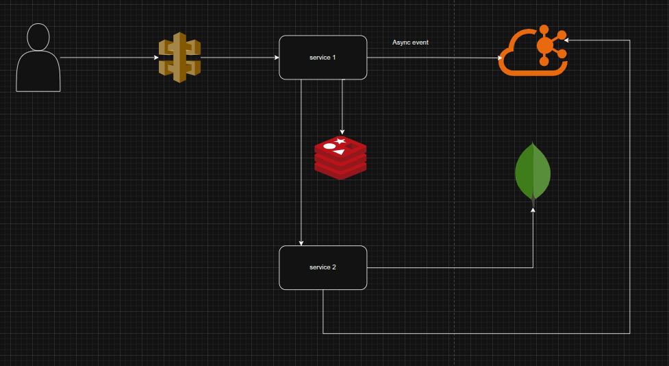

# Invoice & Billing System

A microservices-based invoice and billing application built using **Node.js**, **TypeScript**, **Kafka**, **Redis**, **MongoDB**, and **Docker**.  
It handles customer data ingestion, billing generation (PDF + email), and bulk processing using asynchronous messaging.

---

## Table of Contents

1. Overview
2. Architecture
3. Features
4. Getting Started
   - Prerequisites  
   - Installation
   - Environment Variables  
   - Database & Kafka Setup  
5. How It Works
   - Flow: Customer Ingestion → Billing  
   - Bulk Inserts & Idempotency  
   - PDF Generation & Email Delivery
6. Run the application using Docker Compose only
7. Kubernetes Deployment

---

## Overview

This application is split into **two services** with the following responsibilities:

- **Gateway-service (Ingestion / Customer Processor)**  
  - Receives customer information inputs  
  - Publishes messages to a Kafka topic  
  - Receives billing information, publishing billing messages to Kafka  

- **Core-service (Billing Processor/ Email invoice)**  
  - Consumes billing messages  
  - Generates invoice PDFs  
  - Sends invoice via email to the user  
  - Optionally stores billing records in MongoDB  

This decoupled approach enables scalability, reliability, and asynchronous processing.

---

## Architecture


Supporting components:

- **Redis** — used for idempotency keys, caching, and deduplication  
- **Kafka** — message bus between services  
- **MongoDB** — persistent storage for customer & billing data  
- **Docker** — containerization for services & dependencies
- **Kubernetes** - Deploy app just like production-ready
- **Node.js/Typescript** - Building blocks of the app
- **KONG** - Api Gateway

---

## Features

- Bulk insertion of customers into DB  
- Asynchronous billing generation  
- Idempotent message processing to avoid duplicate work  
- PDF invoice generation  
- Email delivery with retry logic  
- Error handling and dead-lettering  
- Scalable services using message-driven architecture

---

## Getting Started

### Prerequisites

Make sure you have installed:

- Docker & Docker Compose  
- Node.js (if running services outside containers)  
- MongoDB (if not using a container)  
- Kafka cluster (or use Docker)  
- Redis
- Kubernetes (optional if you want to test it on k8s)

### Installation
1. Clone the repository:

   ```bash
   git clone https://github.com/09himanshu/invoice-billing-system.git
   cd invoice-billing-system
   ```
2. Start dependencies and services:
    ```bash
    sh start.sh
    ```
3. Verify services are running:
  ```bash
    docker ps
  ```

4. API Endpoints
   Register Customer
    ```bash
      POST http://localhost:5002/api/v1/user/register
      Content-Type: application/json
      
      {
        "firstname": "John",
        "middlename": "",
        "lastname": "Doe",
        "email": "john.doe@example.com",
        "mobile": "0123456789"
      }
    ```
  Generate Invoice
  ```bash
    POST http://localhost:5002/api/v1/bill/genBill
    Content-Type: application/json
    
    {
      "userId": "john.doe@example.com",
      "items": [
        {
          "productId": "AD234",
          "quantity": 1,
          "price": 899,
          "productName": "Premium T-Shirt"
        }
      ]
    }
  ```
  
### Environment Variables
Each service requires environment variables. Please review the .env.example file in each service directory.

### Database & Kafka Setup
- Kafka topics (users, billing, notify) should be created at service start-up.
- The MongoDB database should be created on insert.

## How It Works
### Customer Registration Flow
- Client sends customer data to Gateway Service via HTTP.
- Gateway service publishes a message to the Kafka insertion topic.
- Core Service consumes messages and performs bulk insert to MongoDB.
- Process acknowledgement sent to Kafka.

### Billing Flow
- Client sends billing request to Gateway Service.
- Gateway publishes a message to the Kafka bill topic.
- Core Service consumes messages and generates PDF invoices.
- Invoice saved to the file system.
- Notification message published to notify the topic.

### Email Notification Flow
- Core Service consumes messages from the notify topic.
- Email assembled with PDF attachment.
- Email sent via SMTP server.
- Retry logic applied for failed deliveries.

## Run the application using Docker Compose only
Make sure you made changes accordingly in the docker-compose.yml file, the environments sections of each service
```bash
sh start.sh
```

## Kubernetes Deployment

    
